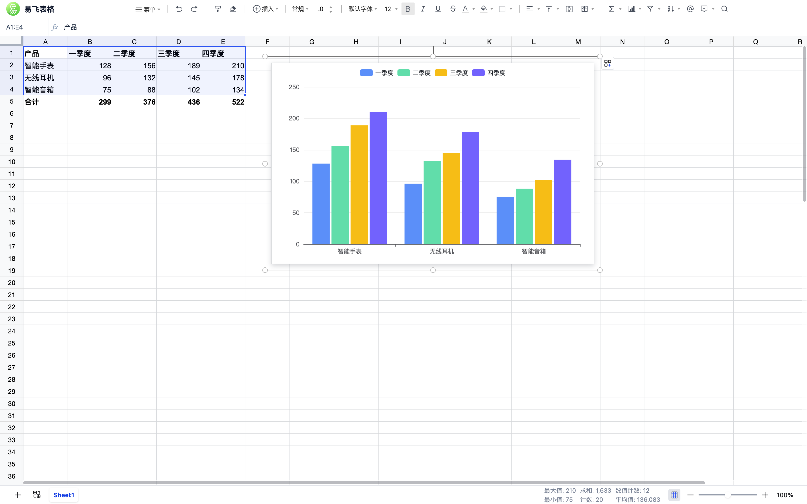
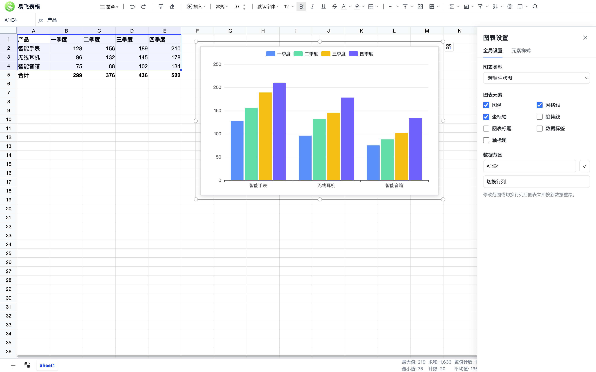

# EFLink Excel 易飞表格

参照企业微信在线表格布局的纯前端 Excel 编辑器。基于 [Univer](https://github.com/dream-num/univer) 表格引擎与 React 构建，**既可以独立运行（本仓库 demo 应用），也可以作为 React 组件嵌入任意应用**（npm 包 `@eflink-tech/excel`）。

A spreadsheet editor (Excel-like) for the web. Run it standalone, or embed `<SheetEditor />` into your React app.

## 截图预览

| 数据与公式 | 图表 | 图表设置 |
| --- | --- | --- |
|  |  |  |

## 功能特性

- 表格引擎：Univer（Apache-2.0 免费核心，`@univerjs/presets` 集成，zh-CN）
- 企微式界面：单行工具栏、公式栏、边栏设置面板、网格边缘 ⊕ 快捷增行列
- 文件能力：自有 `.efexcel`（JSON）备份格式导入导出、导出 PNG（html2canvas）；xlsx 双向转换保留为 headless API
- 编辑能力：公式、数字格式、单元格样式、条件聚合（Σ）、冻结行列、筛选、排序、查找替换、批注、图片与图表
- 持久化：可插拔存储适配器（内置 IndexedDB / 内存），防抖自动保存 + Ctrl/Cmd+S 手动保存
- 工程化：Vite + TypeScript 严格模式 + Vitest 单测 + Playwright e2e + oxlint

## 使用组件

```bash
npm install @eflink-tech/excel
```

```tsx
import { SheetEditor } from '@eflink-tech/excel';
import '@eflink-tech/excel/styles.css';

function Page() {
  return (
    <div style={{ height: '100vh' }}>
      <SheetEditor docId={docId} />
    </div>
  );
}
```

不传 `storage` 时默认使用内置 IndexedDB 存储（库名 `eflink-excel`）。

### SheetEditor Props

| Prop | 类型 | 默认 | 说明 |
| --- | --- | --- | --- |
| `docId` | `string` | 必填 | 要打开的文档 id，内容经 storage 加载 |
| `storage` | `StorageAdapter` | 内置 IndexedDB | 文档存储实现；传入后注册为全局默认 |
| `branding` | `{ logo?: string; name: string } \| false` | `false` | 左上角品牌区（logo + 名称） |
| `showToolbar` | `boolean` | `true` | 是否显示工具栏 |
| `showFormulaBar` | `boolean` | `true` | 是否显示公式栏 |
| `onDocLoaded` | `(doc: SheetDocument) => void` | — | 文档加载完成回调 |
| `onDocError` | `(err: unknown) => void` | — | 文档加载失败/不存在回调 |

### 存储适配器

编辑器所有落库行为都经由 `StorageAdapter`，宿主可注入自己的实现对接后端：

```ts
import type { StorageAdapter } from '@eflink-tech/excel';
import { memoryStorage, setDefaultStorage } from '@eflink-tech/excel';

// 内置：内存存储（无痕场景/测试）
setDefaultStorage(memoryStorage());

// 自定义：对接你的服务端
const restStorage: StorageAdapter = {
  save: (doc) => fetch('/api/sheets', { method: 'POST', body: JSON.stringify(doc) }).then(() => undefined),
  load: (id) => fetch(`/api/sheets/${id}`).then((r) => r.json()),
  list: () => fetch('/api/sheets').then((r) => r.json()),
  delete: (id) => fetch(`/api/sheets/${id}`, { method: 'DELETE' }).then(() => undefined),
  rename: (id, title) => fetch(`/api/sheets/${id}/rename`, { method: 'POST', body: JSON.stringify({ title }) }).then(() => undefined),
  updateContent: (id, title, snapshot) => fetch(`/api/sheets/${id}`, { method: 'PUT', body: JSON.stringify({ title, snapshot }) }).then(() => undefined),
};
```

### headless API

不依赖 UI，直接使用数据模型与转换器：

```ts
import { exportEfexcel, importEfexcel, createDocument } from '@eflink-tech/excel';

const doc = createDocument('我的表格');              // 新文档
exportEfexcel(doc);                                  // 下载 .efexcel 备份文件（JSON）
const imported = await importEfexcel(file);          // .efexcel File → 全新 id 的文档
```

此外保留 `importXlsx / exportXlsx`（exceljs）与 `exportPng` 等 headless 能力。

### 新建前二次确认

「新建表格」等有覆盖风险的动作经 `useUiStore.requestConfirm()` 发起确认弹窗（`ConfirmDialogHost` 已内置于 `SheetEditor`），宿主也可以复用它：

```ts
import { useUiStore } from '@eflink-tech/excel';

const ok = await useUiStore.getState().requestConfirm({
  title: '新建文档',
  message: '新建文档将清空当前内容，请确保已经下载备份文档！',
});
```

## 本地运行 Demo

```bash
pnpm install
pnpm dev          # 组件库 watch 构建 + demo dev server（改组件库源码时用）
# 或
pnpm dev:demo     # 仅 demo（demo 直连组件库源码，无需先构建）
```

打开终端提示的地址（默认 http://localhost:5173）即为完整独立应用：自动打开上次文档/新建文档、工具栏、公式栏、图表、导入导出、自动保存，行为与本仓库线上 demo 一致。

## 目录结构

```
eflink-excel/
├── packages/excel/     # @eflink-tech/excel 组件库（开源主体）
│   └── src/
│       ├── components/ # SheetEditor、工具栏、公式栏、Univer 容器等
│       ├── core/       # Univer 控制器、自动保存、xlsx 双向转换
│       ├── storage/    # StorageAdapter 接口与内置实现
│       ├── store/      # zustand 状态
│       └── index.ts    # 对外导出面
├── apps/demo/          # 独立运行的应用（易飞表格）
├── e2e/                # Playwright 端到端测试（跑在 demo 上）
└── scripts/            # （历史）已迁移至 packages/excel/scripts
```

## 开发

```bash
pnpm lint         # oxlint
pnpm typecheck    # tsc -b
pnpm test         # vitest 单元测试
pnpm test:e2e     # Playwright（自动构建组件库并启动 demo）
pnpm build        # 构建组件库与 demo
```

### Univer 补丁说明

`packages/excel/scripts/patch-univer.js` 在安装后（postinstall）对 Univer 做少量行为修正（粘贴带单引号数字格式、筛选面板定位、图片双击浮层等）。脚本幂等、可重复执行；上游升级后如锚点失配会告警跳过。

> pnpm v10 默认不执行依赖的生命周期脚本。若你用 pnpm 安装本包，请放行一次：
>
> ```yaml
> # pnpm-workspace.yaml
> onlyBuiltDependencies:
>   - "@eflink-tech/excel"
> ```
>
> 或执行 `pnpm approve-builds @eflink-tech/excel`。npm / yarn 用户无此问题。

### 边界与已知约定

- 一个页面同时只挂一个编辑器实例（模块级状态与 `#univer-container` 挂载点为单例设计）
- 编辑器不读写 `localStorage`/`document.title` 等宿主全局（「最近文档」等属宿主职责，经 `onDocLoaded` 回调实现）
- xlsx 高级特性（图表/透视表/条件格式）暂不迁移
- 不做服务端同步与旧 Luckysheet 数据迁移

## License

[MIT](./LICENSE)
